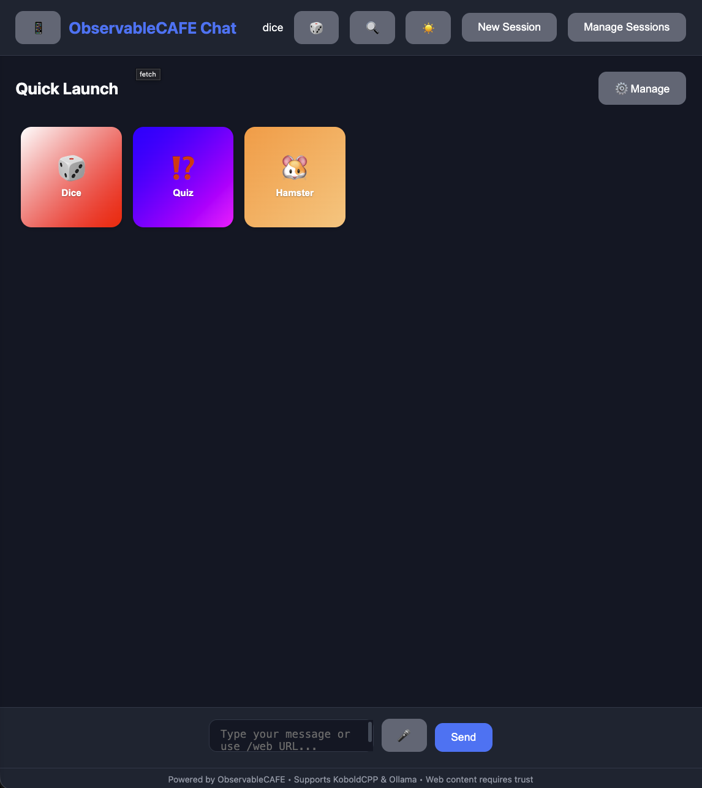
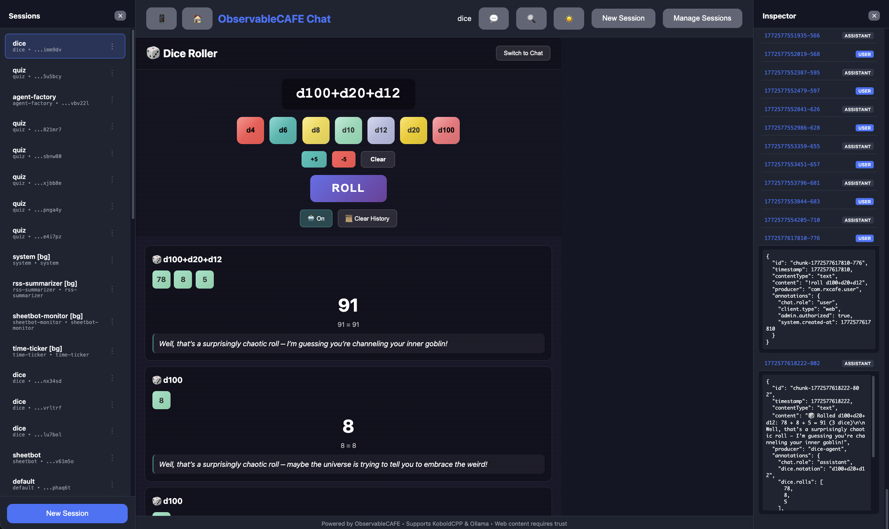

# ObservableCAFE Chat

A reactive chat application built with the ObservableCAFE architecture pattern, using Bun.js. Supports both KoboldCPP and Ollama LLM backends with advanced session management, background agents, and multi-modal support.

## Screenshots







## Philosophy

ObservableCAFE takes a minimalist approach to LLM-powered agents. The core premise is that LLMs should do as little as possible within the agentic loop—instead of iteratively reasoning and acting, they should provide their entire plan (as code) upfront.

This approach has several advantages:

- **Avoids semantic collapse**: Agents stay on track by following explicit code rather than drifting through repeated LLM reasoning.
- **Smaller context sizes**: A single script is far smaller than a multi-turn reasoning trace.
- **Resistant to prompt injection**: Poisoning attacks like "ignore previous instructions" have no effect because the LLM isn't executing commands at runtime—it's generating a script that runs independently.
- **Enables flow reuse**: Generated scripts can be reviewed, tweaked, reused, and composed.
- **Better performance**: Most tasks are more reliably solved by code than by hoping the LLM reasons correctly through multiple steps.

For example, "delete all spam in my inbox" would have an LLM generate a script that fetches emails, runs a classifier against each one, presents the candidates for confirmation, and deletes on approval. Only two LLM calls are needed: one to generate the script, one to classify emails. The rest is deterministic code.

This contrasts with frameworks like OpenClaw that allow free-form agentic loops but have bloated initial context and variable success rates. ObservableCAFE enforces these constraints by design.

ObservableCAFE is particularly useful for highly repetitive workflows. Daily spaced repetition learning, for instance, is completely scripted—the LLM only provides summaries and recommendations at the end. This makes the system reliable enough to run unattended.

ObservableCAFE uses **ReactiveX (RxJS)** for its pipeline architecture—and there's a good reason. LLMs are already fluent in RxJS. They understand operators like `map`, `filter`, `mergeMap`, `catchError`, and they generate clean, declarative code that reads almost like English.

This makes agents remarkably concise and readable. A typical agent is just a dozen lines of RxJS operators describing the data flow:

```typescript
session.inputStream.pipe(
  filter(c => c.annotations['chat.role'] === 'user'),
  mergeMap(chunk => completeTurnWithLLM(chunk, session.createLLMChunkEvaluator())),
  catchError(err => { session.errorStream.next(err); return EMPTY; })
).subscribe({ next: c => session.outputStream.next(c) });
```

Agents are declarative by nature—they say *what* should happen to data, not *how* each step is implemented. This aligns perfectly with the philosophy of generating scripts upfront rather than reasoning at runtime.

**Traditional agents still supported**: If you prefer the classic iterative reasoning-and-acting pattern, you can still build agents that call the LLM in loops. ObservableCAFE doesn't force any particular approach—it's just optimized for the script-generating style.

## Features

- **ObservableCAFE Architecture**: Chunks, annotations, and evaluators following the ObservableCAFE spec.
- **Multiple LLM Backends**: Support for KoboldCPP and Ollama.
- **Advanced Session Management**: 
  - Permanent, collapsible sessions sidebar on desktop.
  - Full-screen mobile sidebar with safe-area optimizations.
  - **URL Hash Synchronization**: Active session is reflected in the URL for easy bookmarking and navigation.
  - Rename and delete sessions directly from the UI.
  - **Cross-Platform Synchronization**: Seamlessly switch between Web and Telegram.
- **Modular Agent System**:
  - **Interactive Agents**: Created on-demand via the UI.
  - **Background Agents**: Persistent agents that start on server boot and can run scheduled tasks.
    - `rss-summarizer`: Fetches and summarizes RSS feeds (e.g., Hacker News) daily at 07:00.
    - `time-ticker`: Periodically outputs the current time.
  - **Agent Factory**: An interactive agent that generates new agents from natural language descriptions using LLM code generation and automatic TypeScript validation.
  - **Declarative Pipelines**: Clean agent definitions using RxJS operators and higher-order evaluators.
  - **Custom Agent Paths**: Load agents from external directories via environment variables.
   - **Tool System**: Agents can call tools using `<|tool_call|>` syntax
     - **Die Roller**: `rollDice` tool for rolling virtual dice (1d6, 2d10+3, etc.)
     - **Tool Detection**: Auto-detects and executes tool calls in LLM responses
   - **Quickies**: Quick presets for agents with predefined prompts and custom UI modes. Create one-click shortcuts to launch agents with specific configurations.
   - **Custom UI Modes**: Agents can specify custom UIs (e.g., the Dice Roller).
   - **Voice Chat Agent** (`voice-chat`): Advanced multi-modal agent that accepts **both text and audio input**. Audio is automatically transcribed using [Handy](https://handy.computer/) (local speech-to-text) and processed through the LLM, enabling hands-free voice conversations. Audio is converted to MP3 on-the-fly for compatibility.
 - **Multi-modal Support**: Handle text and **binary chunks** seamlessly.
  - **Image Painter**: Generates and renders random pixel art images.
  - **Audio Generator**: Generates and plays back audio tones.
  - **Telegram Media**: Images and audio are delivered directly as photos and voice messages.
- **Telegram Bot**: 
  - **Inline Keyboards**: Interactive session switcher via `/sessions`.
  - **Auto-Subscriptions**: Receive automatic updates from specific sessions using `/subscribe <id>`. Subscriptions are persisted in SQLite.
  - **Sharing**: Use `/id` to get session IDs, `/join <id>` to continue web chats on mobile, and `/share` for web links.
  - **Automatic Cleanup**: Temporary "Thinking..." status messages are automatically deleted.
- **Security & Trust**: Untrusted web content is filtered from LLM context until explicitly trusted.
- **HTTPS Support**: Automatic TLS when certificate files are present (self-signed or custom).
- **PWA Ready**: Installable as a Progressive Web App on mobile and desktop.

## Architecture

This app implements the ObservableCAFE pattern:

- **Chunks** (`lib/chunk.ts`): Immutable data units (text, binary, or null) with producer IDs and annotations.
- **Streams** (`lib/stream.ts`): RxJS-based reactive streams that process chunks through agent-defined pipelines.
- **Agents** (`agents/`): Pipeline builders that subscribe to `inputStream` and emit to `outputStream`.
- **Evaluators** (`evaluators/`, `lib/evaluator-utils.ts`): Encapsulated logic for specific tasks like sentiment analysis, RSS parsing, or chat completion.
- **Persistence**: All sessions, configurations, and histories are saved to an SQLite database.

## Setup

1. **Install dependencies**:
   ```bash
   bun install
   ```

2. **Configure your LLM backend**:

   **Option A: KoboldCPP**
   ```bash
   export LLM_BACKEND=kobold
   export KOBOLD_URL=http://localhost:5001
   ```

   **Option B: Ollama**
   ```bash
   export LLM_BACKEND=ollama
   export OLLAMA_URL=http://localhost:11434
   export OLLAMA_MODEL=gemma3:1b  # or any model you have pulled
   ```

3. **(Optional) Configure Telegram Bot**:
   ```bash
   export TELEGRAM_TOKEN=your_bot_token_here
   # Authorize your user
   bun start -- --trust-telegram <your_username_or_id>
   ```

4. **(Optional) Configure Voice Chat**: For voice input support, install and run [Handy](https://handy.computer/) (free, offline speech-to-text). You need a version with local API capabilities, which may be a fork (https://github.com/jorisvddonk/Handy)

5. **Run the server**:
   ```bash
   bun start
   ```

6. **Open the app**:
   Navigate to `http://localhost:3000`

## HTTPS / TLS

The server automatically enables HTTPS when it detects TLS certificate files in the project root:

### Automatic HTTPS (Self-Signed)

Generate a self-signed certificate (included in repo):
```bash
openssl req -x509 -newkey rsa:4096 -keyout key.pem -out cert.pem -days 365 -nodes -subj "/CN=localhost"
```

The server will automatically use HTTPS when `cert.pem` exists.

### Custom Certificates

Replace `cert.pem` and `key.pem` with your own certificate files. The server will detect them and enable HTTPS automatically.

### Force HTTPS / Disable

Use the `USE_HTTPS` environment variable to override auto-detection:
```bash
# Force HTTPS even without cert files (will fail if missing)
export USE_HTTPS=true

# Force HTTP even with cert files present
export USE_HTTPS=false
```

### Accessing the Server

When HTTPS is enabled, the server URL changes:
- HTTP: `http://localhost:3000`
- HTTPS: `https://localhost:3000`

The console output will show the correct URL on startup.

> **Note**: Self-signed certificates will trigger browser warnings. This is expected - click "Advanced" → "Proceed" (or add a security exception) to continue.

## Terminal UI (TUI)

A terminal-based interface is also available for command-line chat:

```bash
# Set token (or use --token flag)
export RXCAFE_TOKEN=your-token

# Run the TUI
bun run tui
```

### Options

- `--url <url>` - Server URL (default: `http://localhost:3000`)
- `--token <token>` - API token (can also use `RXCAFE_TOKEN` env var)

### Commands

- `/help` - Show available commands
- `/sessions` - Switch between sessions
- `/new` - Create new session
- `/clear` - Clear messages
- `/rename <name>` - Rename current session
- `/delete` - Delete current session
- `/system <prompt>` - Set system prompt
- `/quit` or `/exit` - Exit
- `//<cmd>` - Forward command to agent (e.g., `//help` sends `/help` to the agent)

## Cross-Platform Sharing

You can seamlessly move conversations between the Web UI and Telegram:

1.  **Web to Telegram**: Click the **🆔** icon in the Web header to copy the Session ID. In Telegram, type `/join [pasted-id]`.
2.  **Telegram to Web**: Type `/share` in Telegram to get a direct browser link to your current session.
3.  **Default Session**: New Telegram users start in the `default-telegram` session by default.

### Telegram Auto-Subscriptions

You can turn your Telegram bot into a real-time notification feed for specific sessions:

- `/subscribe <session_id>`: Automatically receive all new messages and media from that session.
- `/unsubscribe <session_id>`: Stop receiving automatic updates.
- `/subscriptions`: List your active auto-subscriptions.

Subscriptions are stored in the database and automatically restored when the server restarts. You can subscribe to multiple sessions simultaneously (e.g., your main chat and a background agent like `rss-summarizer`).

## Agents and External Paths

Agents are discovered automatically in the `agents/` directory. You can also load agents from external directories by setting the `ObservableCAFE_AGENT_SEARCH_PATHS` variable:

```bash
export ObservableCAFE_AGENT_SEARCH_PATHS="/path/to/my/agents:/opt/custom-agents"
bun start
```

### Agent Reloading

Agents can be reloaded at runtime using the System agent:

- `!reload` - Intelligently reloads only agents whose source code has changed (detected via file hash). Existing sessions are re-initialized to use the new code.
- `!reload-force` - Force reloads all agents (or specific ones if listed).

Agents can opt-out of reloading by setting `allowsReload: false` in their definition. This is useful for agents that maintain in-memory state (like `anki`):

```typescript
export const myAgent: AgentDefinition = {
  name: 'my-stateful-agent',
  allowsReload: false,  // Prevents reload - preserves in-memory state
  async initialize(session) {
    // Agent maintains state in memory...
  }
};
```

### Voice Chat Agent

The `voice-chat` agent is an advanced multi-modal agent that seamlessly blends **text and voice input**:

1. **Audio Input**: Send audio chunks (WAV, WebM, OGG, etc.) - they're automatically converted to MP3 and transcribed using [Handy](https://handy.computer/)'s local Whisper/Parakeet API
2. **Text Input**: Regular text messages work exactly like the default agent
3. **Unified Output**: Both input types are processed through the LLM for intelligent responses

**Use Cases**:
- Hands-free chat while driving or cooking
- Accessibility for users who prefer voice input
- Quick voice notes that get transcribed and processed

**Creating a Voice Chat Session**:
```bash
curl -X POST http://localhost:3000/api/session \
  -H "Content-Type: application/json" \
  -H "Authorization: Bearer <your-token>" \
  -d '{
    "agentId": "voice-chat",
    "backend": "ollama",
    "model": "gemma3:1b",
    "systemPrompt": "You are a helpful voice assistant"
  }'
```

**Sending Audio**:
```bash
curl -X POST http://localhost:3000/api/session/<session-id>/chunk \
  -H "Authorization: Bearer <your-token>" \
  -F "file=@recording.wav"
```

The agent handles audio format conversion automatically and streams the LLM response just like text input.

## Quickies

Quickies provide one-click shortcuts to launch agents with predefined prompts and configurations. They appear as colorful cards in the UI for quick access.

### Creating Quickies

Quickies can be created via the UI (click the **⚡ Quickies** button) or via the API:

```bash
curl -X POST http://localhost:3000/api/quickies \
  -H "Content-Type: application/json" \
  -H "Authorization: Bearer <your-token>" \
  -d '{
    "presetId": 1,
    "name": "Creative Writer",
    "description": "Help me write creatively",
    "emoji": "✍️",
    "gradientStart": "#FF6B6B",
    "gradientEnd": "#4ECDC4",
    "starterChunk": "I want to write a short story about...",
    "uiMode": "chat",
    "displayOrder": 0
  }'
```

### UI Modes

Quickies support different UI modes:

- **`chat`** (default): Standard chat interface
- **`game-dice`**: Full-screen dice roller UI for the dice agent

### Listing Quickies

```bash
curl http://localhost:3000/api/quickies \
  -H "Authorization: Bearer <your-token>"
```

## Dice Roller

The `dice` agent provides both chat-based and visual dice rolling with full notation support.

### Dice Notation

- `2d6` - Roll 2 six-sided dice
- `1d20+5` - Roll 1d20 and add 5
- `4d6kh3` - Roll 4d6, keep highest 3 (drop lowest)
- `d6+d8-2` - Roll d6 and d8, subtract 2

### Chat Mode

Send dice notation as messages:
```
roll 3d6+2
```

### Game Dice UI Mode

When launched via a Quickie with `uiMode: "game-dice"`, the dice agent displays an animated 3D dice interface:

- Click dice buttons (d4, d6, d8, d10, d12, d20) to add to the pool
- Click the roll area to roll all dice
- History of rolls is preserved during the session

## API Endpoints

### Sessions
- `GET /api/sessions` - List all active and persisted sessions.
- `POST /api/session` - Create a new session.
- `GET /api/session/:id/history` - Get full session history.
- `DELETE /api/session/:id` - Shut down and delete a session.

### Messaging
- `POST /api/chat/:sessionId` - Send a message (returns token stream).
- `GET /api/session/:sessionId/stream` - Persistent SSE stream for all session activity.
- `POST /api/session/:id/chunk` - Add a generic chunk (text, binary, or null).
- `POST /api/session/:id/web` - Fetch web content as untrusted chunk.

### System Agent (Admin-only)

The System agent provides administrative operations via the API. Session ID: `system`. Requires an admin token.

```bash
# Example: Reload agents
curl -X POST http://localhost:3000/api/system/command \
  -H "Content-Type: application/json" \
  -H "Authorization: Bearer <admin-token>" \
  -d '{"command": "!reload"}'
```

#### Commands

| Command | Description |
|---------|-------------|
| `!tokens` | List all API tokens |
| `!token-create [desc] [--admin]` | Create new token |
| `!token-revoke <id>` | Revoke a token |
| `!token-admin <id>` | Toggle admin status |
| `!telegram-users` | List trusted Telegram users |
| `!telegram-trust <id\|username> [desc]` | Trust a Telegram user |
| `!telegram-untrust <id\|username>` | Untrust a Telegram user |
| `!sessions` | List all active sessions |
| `!session-kill <id>` | Delete a session |
| `!agents` | List connected agents |
| `!agent-kick <id>` | Unregister an agent |
| `!status` | Show system health summary |
| `!reload [agents...]` | Reload agents with source changes |
| `!reload-force [agents...]` | Force reload all (or specific) agents |
| `!help` | Show available commands |

The `!reload` command intelligently reloads only agents whose source code has actually changed (detected via file hash). It also re-initializes existing sessions so they use the new code. Agents with `allowsReload: false` (like `anki`) preserve their state - new sessions get the updated code, existing sessions keep the old instance.

Use `!reload-force` to reload all agents regardless of whether their source changed.

## Environment Variables

- `LLM_BACKEND`: Default LLM backend: `kobold` or `ollama`.
- `KOBOLD_URL` - KoboldCPP server URL.
- `OLLAMA_URL` - Ollama server URL.
- `ObservableCAFE_AGENT_SEARCH_PATHS`: Colon-separated list of directories to scan for agents.
- `PORT`: HTTP server port (default: `3000`).
- `USE_HTTPS`: Force HTTPS on (`true`) or off (`false`). Auto-detected by default based on cert file presence.
- `ObservableCAFE_TRACE`: Set to `1` to enable detailed logging of LLM context.
- `TELEGRAM_TOKEN`: Telegram bot token.
- `TRUST_DB_PATH`: Path to the SQLite trust and session database.
- `RXCAFE_URL`: TUI server URL (default: `http://localhost:3000`).
- `RXCAFE_TOKEN`: TUI API token (generate with `bun start -- --generate-token`).

## Security Model

1. **Untrusted by Default**: Web content and external data are marked untrusted.
2. **Stream Filtering**: Agents filter out untrusted chunks before they reach LLM evaluators.
3. **User in the Loop**: Users must explicitly click "Trust" on chunks to include them in the LLM's memory.
4. **Binary Safety**: Binary chunks (like images/audio) are rendered for users but excluded from text-only context unless handled by a multi-modal evaluator.

## License

MIT
